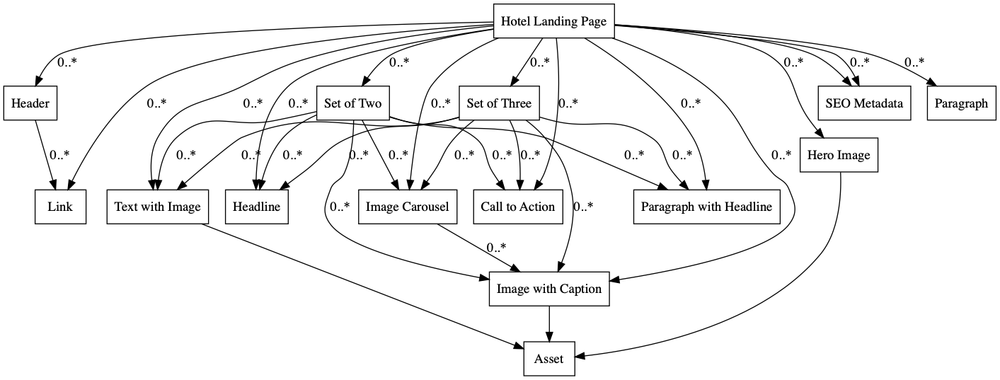
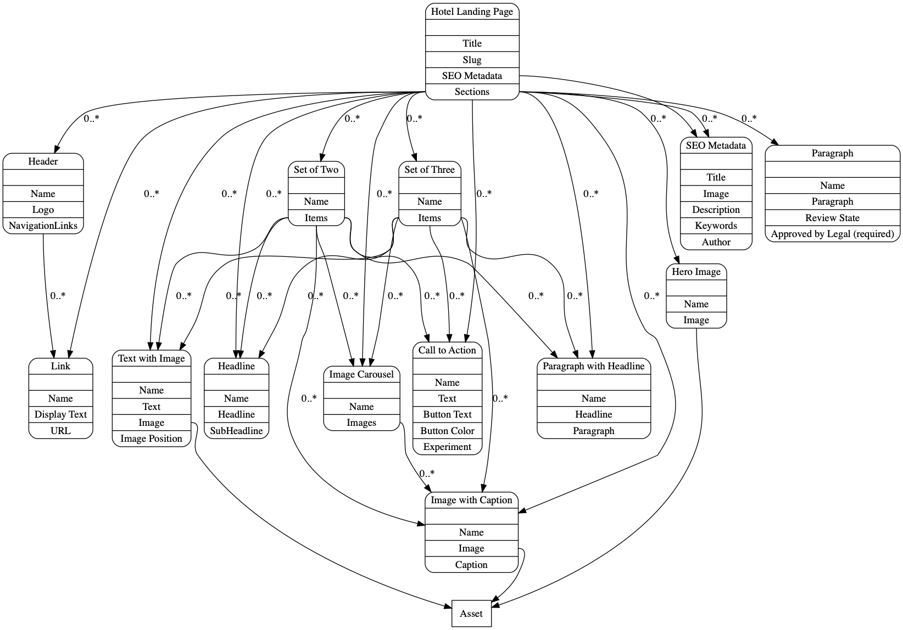

# Contentful Learning Demo

### Get the source code and install dependencies.

```
$ git clone git@github.com:contentful/The-Learning-Demo.git
$ npm install
```

### Set up of the needed content model and create a configuration file

```
npm i -g contentful-cli
```

```
contentful login
```
### `npm run dev`

Run in the project locally.

1. Bring up a Terminal window on your Mac - the application named “Terminal”
2. Make sure you have [Node.js](https://nodejs.org/en/download/) installed on your Mac. Double-check it got installed by looking at what version you are on by typing `node --version` in the terminal window
3. Install the Contentful CLI on your laptop - `sudo npm install -g contentful-cli`
4. Store your Content Management API token on your laptop for future use by typing `contentful login` in your terminal window and follow the prompts
5. Create/select a new Contentful space that supports 2 or more environments
6. Go to the TLD Github repo and copy the URL to clone it here by clicking on the "Use HTTPS" link: `https://github.com/contentful/The-Learning-Demo`
7. Create a new directory for the demo on your laptop `mkdir tld`
8. Go to the new directory `cd tld`
9. Clone the Github repo: `git clone https://github.com/contentful/The-Learning-Demo .`
10. Run the install script: `bin/install.sh` in a terminal window. This script will prompt you for your Contentful space ID and CDA token, then import the demo's content model and content, and finally create a new "demo" environment which the demo site uses
11. Go to API keys in the Contentful app, scroll to the bottom, check the checkbox for demo and hit Save at the top. If you forget to do this the demo will display an empty page!!!
12. Start the Node.js web server by typing `npm run dev` in your terminal window
13. Open your browser to `http://localhost:8080`. If you don't see any content after choosing Paradise Ocean Beach resorts it's probably because there was a problem creating your demo environment - such as when you use a space that only supports one environment, or you didn’t do step 11
14. To stop the web site from running on your laptop just type `Control-C` in your terminal window
15. To start up the demo later open a terminal window, `cd` to the directory where you installed the demo and type `npm run dev`

## Content model




