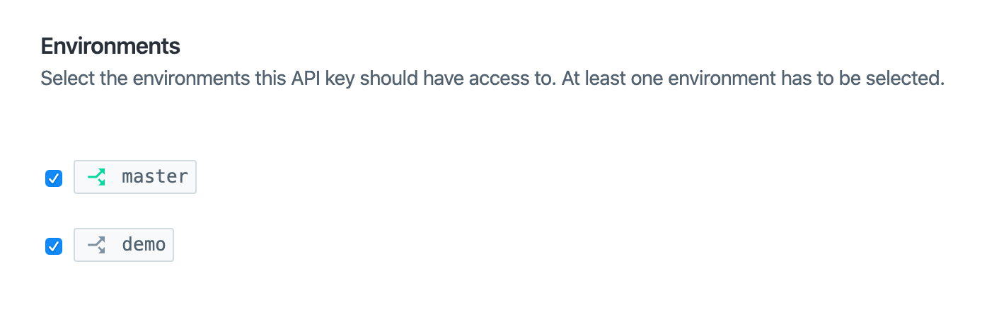

# Contentful Learning Demo


### Get the source code and install dependencies.

```
$ git clone https://github.com/contentful/The-Learning-Demo.git .
$ npm install
```

### Set up of the needed content model and create a configuration file

```
$ npm i -g contentful-cli
```

```
$ contentful login
```

### Run the installation script

```
$ npm run setup
```

### Important! Give your API key access to the new demo environment



### Run in the project locally

```
$ npm run dev
```
### View the app in a browser

```
http://localhost:8080/
```

## Content model


